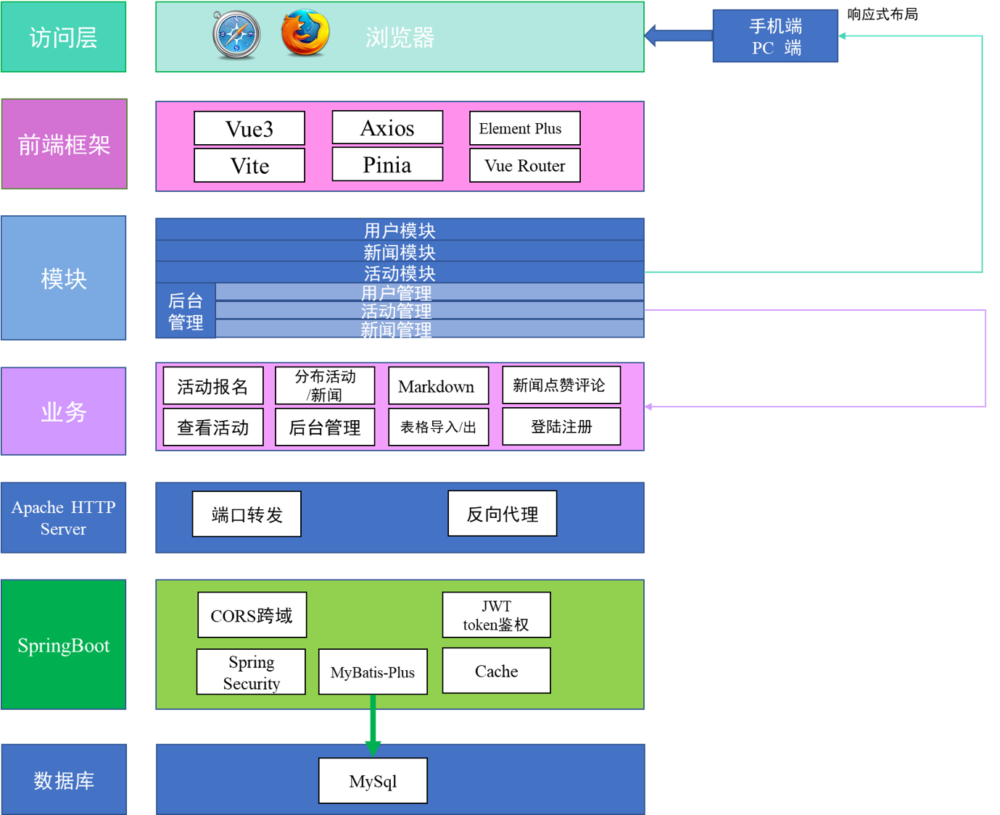
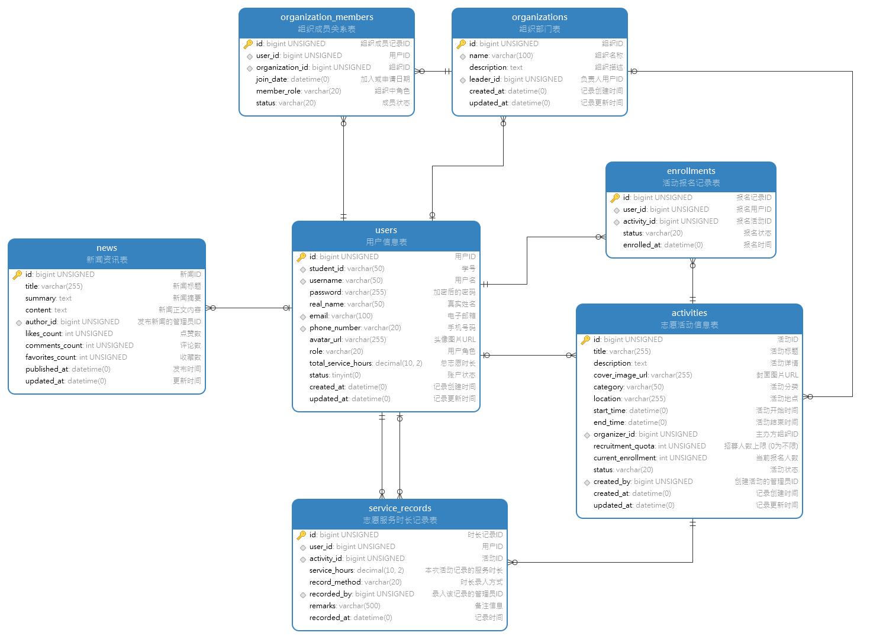
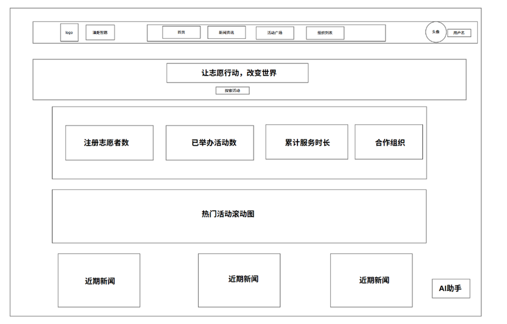
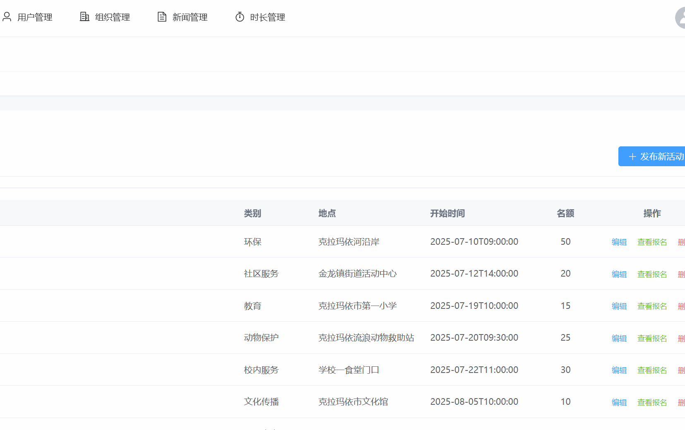
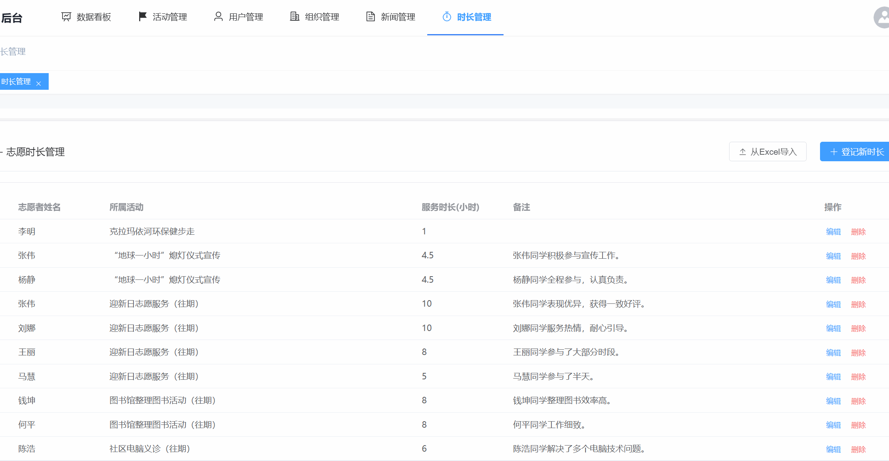

# CUPK 计算机系 2025 web小学期 第一组

## 项目许可

 [![CC BY-NC-SA 4.0][cc-by-nc-sa-shield]][cc-by-nc-sa]

本作品根据[署名—非商业性使用—相同方式共享 4.0 协议][cc-by-nc-sa]进行许可。

[![CC BY-NC-SA 4.0][cc-by-nc-sa-image]][cc-by-nc-sa]

[cc-by-nc-sa]: http://creativecommons.org/licenses/by-nc-sa/4.0/
[cc-by-nc-sa-image]: https://licensebuttons.net/l/by-nc-sa/4.0/88x31.png
[cc-by-nc-sa-shield]: https://img.shields.io/badge/License-CC%20BY--NC--SA%204.0-lightgrey.svg

## 成员

| 序号 | 学号 | 姓名   | 班级       |
| :--- | :--- | :----- | :--------- |
| 37   | XXX  | 胡林森 | 数据23-3班 |
| 93   | XXX  | 郑智   | 数据23-3班 |
| 94   | XXX  | 周程   | 数据23-1班 |
| 139  | XXX  | 郭人禄 | 软工23-2班 |
| 157  | XXX  | 贺仁铭 | 软工23-2班 |

## 项目描述

### 项目选题

油炬智愿 —— 中国石油大学（北京）克拉玛依校区志愿服务平台

### 技术栈

- 后端：Java SpringBoot, Spring MVC, Spring Security, Mybatis-Plus,JWT
- 构建工具：Maven（后端）,Vite（前端）
- 前端： Vue3、Pinia、Vue Router、Axios、Element Plus
- 数据库：MySQL
- 版本管理：Git
- 代码托管：GitHub
- 服务器：Docker

### 开发环境

- 后端开发环境: JDK 21 (LTS)
- 前端开发环境: Node.js 22 (LTS)
- 容器化环境: Docker Desktop 

### 技术架构

### 数据库设计

## 功能展示

#### 用户端

首页通过结构化的信息布局和视觉元素，向所有访问者（包括潜在志愿者、活动组织者及普通访客）传递平台的核心价值、功能概览与最新动态，并作为核心流量分发枢纽，引导用户至平台内各功能模块。

前台主要功能展示：新闻、报名

---

#### 管理端

各项管理展示

活动信息导出功能

志愿时长导入功能

## 团队分工

| 组长     | 郑智                                                         |
| :------- | :----------------------------------------------------------- |
| 工作内容 | 1、后端开发：负责后台管理系统的整体架构设计与实现，包括用户、活动、组织、新闻、管理模块的Controller、Service、Mapper层开发；主导数据库表结构设计与SQL脚本编写。 2、前端开发：负责后台管理系统的所有Vue页面开发，包括仪表盘、各资源管理表格、新增/编辑弹窗、以及多标签页导航等功能的实现。 3、文档编写：负责项目技术栈/软件操作/第7章主要内容等文档的整体撰写与整合、API接口文档的设计与维护。 4、其它工作：项目规划、技术选型、任务分配、代码合并与审查、以及团队协作的日常协调; 展示视频制作、剪辑。 |
| 组员     | 周程                                                         |
| 工作内容 | 1、后端开发：AI功能开发与实现、新闻相关功能实现。 2、前端开发：AI功能对应前端功能实现、新闻列表功能对应前端功能实现、Markdown嵌入。 3、文档编写：第7章主要内容、5.1节编写、接口文档。 4、其他工作：Github仓库维护、展示视频剪辑。 |
| 组员     | 胡林森                                                       |
| 工作内容 | 1.后端开发：负责用户认证系统、核心业务（Excel导入/导出、时长录入）及系统安全（Spring Security）与跨域配置。 2.前端开发：主导登录注册、个人中心及数据管理（时长导入/导出）等关键模块前端实现、协助后台管理前端迭代优化。 3.文档撰写：承担项目报告的整体框架设计与核心章节（1-4章、各模块描述、8.1、8.2节）的撰写，并负责所有业务流程图的绘制。 4.其他工作：担任代码库维护者，为团队成员提供技术支持与Debug协助；展示视频简单剪辑。 |
| 组员     | 郭人禄                                                       |
| 工作内容 | 1、后端开发：  活动广场、活动详情相应接口开发与实现 2、前端开发：  活动广场、活动详情相应页面的实现 3、文档编写：  文档附录接口，第5章模块描述，界面设计，第四章功能架构图，部分排版 4、其它工作：  接口测试，代码合并。 |
| 组员     | 贺仁铭                                                       |
| 工作内容 | 1、后端开发：登录注册模块开发 2、前端开发：登录注册前端奠基 3、文档编写：ER图绘制、数据库设计分析、展示PPT制作 4、其它工作：功能测试、调试；配合团队工作；积极学习前后端开发。 |

## 整体成绩

| 指标         | 细则                                                         | 等级                  | 成绩 |
| ------------ | ------------------------------------------------------------ | --------------------- | ---- |
| 报告（10分） | 内容详细度 格式规范度 绘图规范度                   | 好 好 较好  | 9    |
| 数据（10分） | 基本数据完整度 关联关系正确度 ER图与数据表         | 好 好 好    | 10   |
| 页面（20分） | 前台样式 后台样式 框        架                     | 好 较好 VUE | 18   |
| 功能（60分） | 功能完整性 功能实用性 技术复杂度                   | 好 好 较好  | 56   |
| 总评         | 界面美观，数据库设计合理，功能较实用、完善，报告内容较完整。 | 好                    | 93   |

[cc-by-nc-sa]: 
